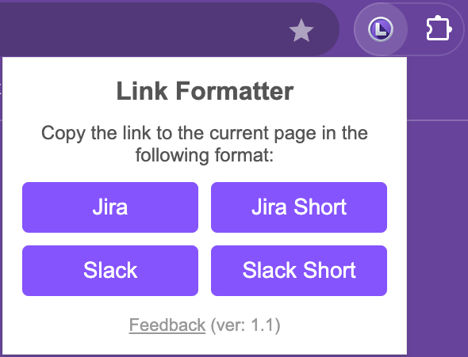

# Chrome Link Formatter

A lightweight Chrome extension that copies the current page’s title and URL in **Jira** or **Slack-friendly** markup. It automatically sanitizes special characters so your links don’t break the target format.  

## Features

- **One-click** copy of the current page’s title and URL.
- **Jira** format: `[Title|URL]`
- **Slack** format: `[Title](URL)`
- **Jira Short** / **Slack Short**: Automatically truncate the title
- **Auto-sanitization** of special characters (e.g. braces, brackets, pipes).

## Installation

1. **Clone or download** this repository.
2. Go to `chrome://extensions/` in Google Chrome.
3. Enable **Developer Mode** (toggle in the top-right corner).
4. Click **Load unpacked** and select the folder containing `manifest.json`.

The extension should now appear in your toolbar. Pin it for quick access.

## Usage

1. Open any webpage in Chrome.
2. Click the **Chrome Link Formatter** icon.
3. Choose the format you need:
   - **Jira** → copies `[Title|URL]`
   - **Jira Short** → copies `[ShortTitle|URL]` (truncated to 35 chars)
   - **Slack** → copies `[Title](URL)`
   - **Slack Short** → copies `[ShortTitle](URL)` (truncated to 35 chars)
4. Paste anywhere you want to reference the link!

## Contributing

1. Fork this repository.
2. Create a feature branch (`git checkout -b feature/my-feature`).
3. Commit your changes (`git commit -m 'Add some feature'`).
4. Push to the branch (`git push origin feature/my-feature`).
5. Open a **Pull Request**.

## Support / Contact
schek.it@gmail.com

Feel free to use this project as you see fit. Contributions are welcome!
